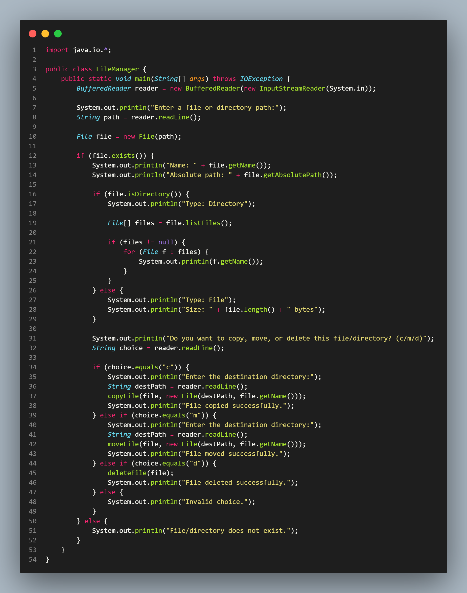
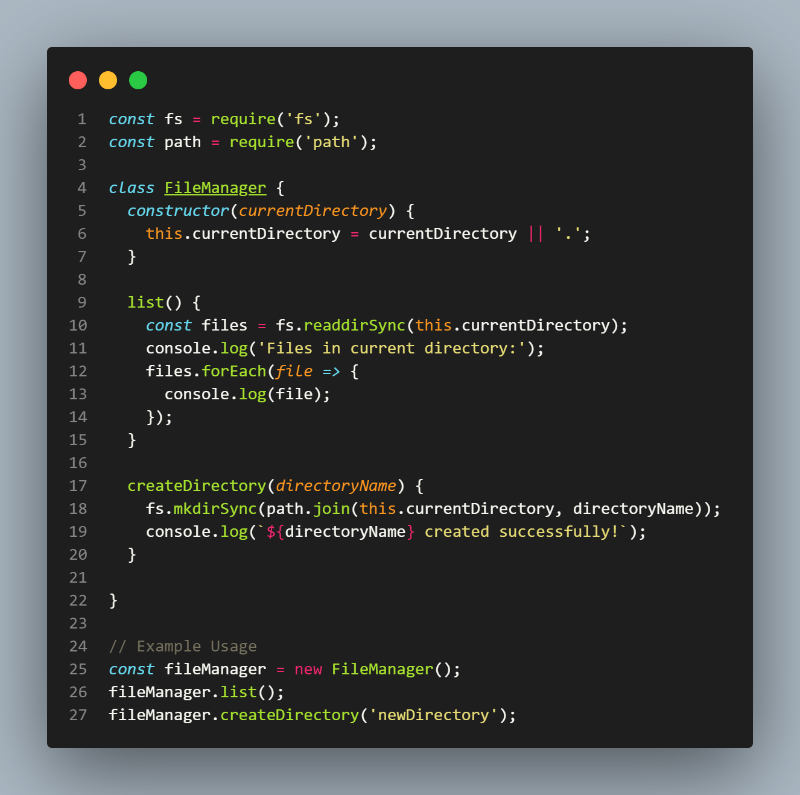
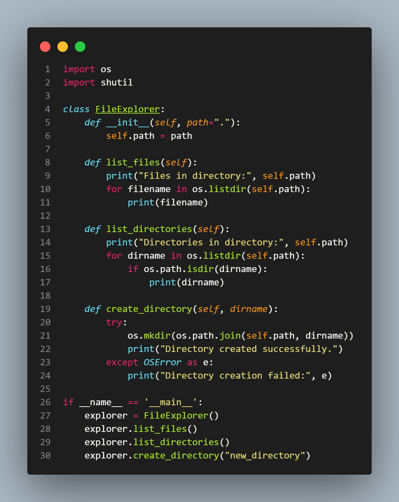
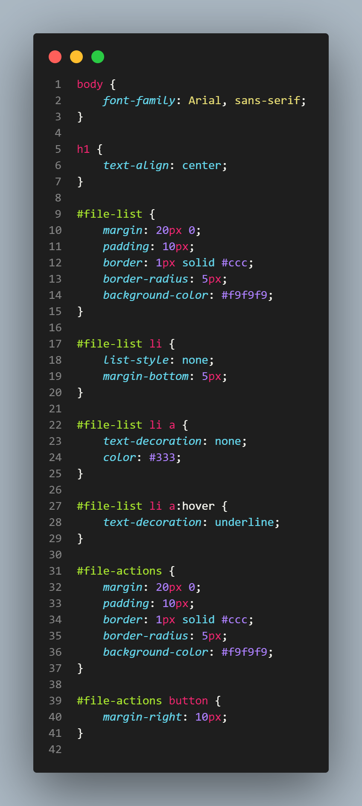

# Monokai Dark Theme

## Installation

This extension is available for free in the [Visual Studio Code Marketplace](https://marketplace.visualstudio.com/items?itemName=Treevel.monokai-dark-theme).

## Screenshots

### Whole Editor

### Java

### JavaScript

### PHP

### Python

### HTML

### CSS

## License

The Monokai Dark Theme is available under the [MIT license](https://github.com/treevel/vscode-theme-monokai-dark/blob/master/LICENSE)
